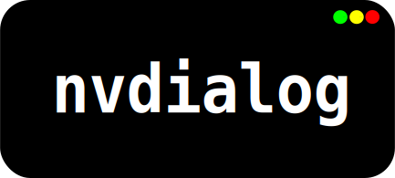
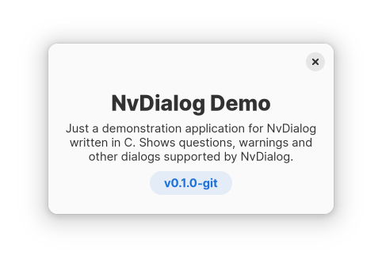
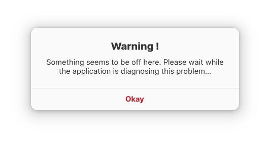
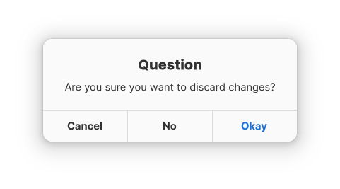

<div align="center">
        
        <h1>NvDialog</h1>
        <a href="#example">Examples</a> | 
        <a href="#screenshots">Screenshots</a> |
        <a href="#installation">Installing</a> |
        <a href="https://github.com/AndroGR/nvdialog/releases">Releases</a>
        <h5><b>A simple, cross-platform dialog box library.</b></h5>
<code>libnvdialog</code> is a simple dialog box library written in C
for multiple purposes such as games, app development, simple UI boxes for terminal apps or pretty much anything else. NvDialog uses the host's UI library (eg. <a href="https://gtk.org">Gtk3 / Gtk4</a> on Linux and other Unix like OSes, <a href="https://developer.apple.com/library/archive/documentation/Cocoa/Conceptual/CocoaFundamentals/WhatIsCocoa/WhatIsCocoa.html">the Cocoa API</a> on MacOS X or the <a href="https://learn.microsoft.com/en-us/windows/win32/apiindex/windows-api-list">WinAPI</a> for Windows) to achieve a look and feel that follows the system theme and design guidelines.
<br>
<br>


<br>


<br> <br>
</div>

# Features
- Simple, high level C API with low overhead (See [examples/](./examples/)).
- 100% guaranteed native looking dialogs.
- MIT Licensed.
- Cross-compiler (Actively tested with `gcc`, `clang` and MSVC).
- Supports most desktop platforms through 3 different implementations (Backends).
- Legacy version support (See [OS Versions Supported](#os-versions-supported))

# Backends
- **Adwaita Backend**\
A backend using Gtk4 and `libadwaita`. This backend has replaced the (following) Gtk3 backend since 0.2.0 was released. Also note, this backend makes use of hardware acceleration, which sometimes breaks games in Wayland.

- **Gtk3 Backend**\
Some older distributions do not have Adwaita / Gtk4 support yet. The Gtk3 backend can be used in such a situation. However Gtk3 is considered to be deprecated and has been replaced with the Adwaita backend.

- **Cocoa Backend**\
The Cocoa backend was recently added to NvDialog for MacOS X support. It is written in Objective-C for better integration with the OS, and is still in the experimental stage. Please report any bugs or features that need to be fixed / implemented.

- **Win32 Backend**\
Windows-specific backend, used only for Windows compatibility. This backend is mainly tested on GNU/Linux with `wine`, and so some bugs may not be detected. Open an issue if that's the case.

# Example
This is a simple cross-platform example of a simple message box greeting the user:
```c
#include <stdlib.h>
#include <nvdialog/nvdialog.h>

int main(int argc, char **argv)
{
        if (nvd_init(argv[0]) != 0) {
                puts("Failed to initialize NvDialog.\n");
                exit(EXIT_FAILURE);
        }

        NvdDialogBox* dialog = nvd_dialog_box_new(
                "Hello, world!", // Title of the dialog
                "Hello world ! This is a dialog box created using libnvdialog!", // Message of the dialog
                NVD_DIALOG_SIMPLE // What is the dialog representing? (Eg a warning). In this
                                  // case, it represents a simple dialog with no context.
        );

        nvd_show_dialog(dialog);
        nvd_free_object(dialog);
        return 0;
}
```

# Screenshots
<div>
        <h4><b>"About application" dialog.</b></h4>
        </img>
        <h4><b>Dialog box with a warning.</b></h4>
        </img>
        <h4><b>Question dialog box</b></h4>
        </img>
</div>

# Installation
Make sure you have installed [CMake](https://cmake.org) before doing anything else ! The library can only be installed using CMake. See [CMake's website](https://cmake.org/) for more information.
- First, download the source code in your preferred way. The [Releases](https://github.com/AndroGR/nvdialog/releases/) are recommended if you are looking for stability, but you can also optionally compile from
the GitHub repository directly, by cloning the source code.
- Compile the library:
```sh
$ mkdir build/ && cd build/
$ cmake ..
$ cmake --build .
```

- And install it on your system:
```sh
$ sudo cmake --install .
```

# Installing on Arch Linux
###### *TODO: Upload the library to the AUR.*
For Arch Linux and derivatives, a `PKGBUILD` is provided to build the library as a package. It is recommended to use it this way to allow uninstalling the library easily.\
To install the library as an Arch Linux package, enter the following commands:

**Download `git`** (Required to download the source code)
```bash
$ sudo pacman -S git
```
**Clone the repository (To download the source code)**
```bash
$ git clone --depth=1 https://github.com/AndroGR/nvdialog.git
$ cd nvdialog/
```
**Build the package:**
```bash
$ makepkg --clean --install
```

# OS Versions Supported
## Windows
Although all functions used by NvDialog were introduced back in Windows XP, they have not been tested for stability before Windows 8.1 (The oldest officially supported release by NvDialog) and if you are writing an application for such old systems you are on your own, either fork the codebase or open an issue.

## macOS
Only the very latest versions of macOS are supported. Older releases will at best throw a compiler error if compiling from source or a linking error otherwise.

Some deprecated functions are used here and there when building for macOS. This shouldn't worry you since Apple does give enough time for developers to switch away without enforcing it.

## GNU/Linux
Since there are well over 1000 distributions, there is no specific distribution requirement. However, your system must have these installed:
- Gtk 3 or `libadwaita` + Gtk4, the latest releases of each.
- A modern version of `glibc`, preferably 2.33 or newer.
- Linux kernel 2.6 or newer (All modern distros include at least 4.x kernels so nothing to worry here).
- X11 or Wayland as the display server. Mir is not supported.

Common distros officially supported:
| Distro | Version |
|   ---  |   ---   |
| Arch Linux | (Rolling) |
| Ubuntu and derivatives | >16.04 |
| Debian and derivatives | >Debian 7 |
| Slackware Linux | Latest |

## Android
Android support will not be implemented anytime soon (Neither iOS support). You are advised instead to use Android's `AlertDialog` class or your UI library, which would achieve the same effect.

## Other OSes
Other OSes are assumed to be supported. To make sure they do indeed work, you need to make sure the given OS supports **all** of the following features:
- Unix-like, or alternatively, **very closely** resembling Windows.
- X11 or Wayland as the windowing system
- Gtk3, or Gtk4 and Libadwaita

# License
`nvdialog` is licensed under the MIT license. See [COPYING](./COPYING) for more.
All contributions made to the library are assumed to be licensed under the MIT license as well. However, you may specify a different license if you wish.
