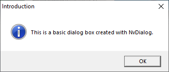
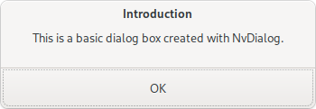
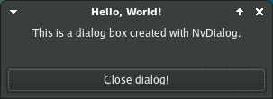

<div align="center">
        
        <h1>NvDialog</h1>
        <a href="#example">Examples</a> | 
        <a href="#screenshots">Screenshots</a> |
        <a href="#installation">Installing</a> |
        <a href="https://github.com/AndroGR/nvdialog/releases">Releases</a>
        <h5><b>A simple, cross-platform dialog box library.</b></h5>
<code>libnvdialog</code> is a simple, efficient, batteries-included dialog box library written in C
for multiple purposes such as games, app development, simple UI boxes for terminal apps or pretty much anything else. NvDialog uses the host's UI library (eg. <a href="https://gtk.org">Gtk3</a> on Linux and other Unix like OSes, <a href="https://developer.apple.com/library/archive/documentation/Cocoa/Conceptual/CocoaFundamentals/WhatIsCocoa/WhatIsCocoa.html">the Cocoa API</a> on macOS or the <a href="https://learn.microsoft.com/en-us/windows/win32/apiindex/windows-api-list">WinAPI</a> for Windows) to achieve a look and feel that follows the system theme and design guidelines without depending on extra libraries or themes. In addition, NvDialog provides official <a href="https://github.com/tseli0s/nvdialog-rs">Rust bindings</a> and can be used, thanks to its simple C ABI, with almost every language on the planet.
<br>
<br>


<br>


<br> <br>
<h6><i>This project is in immediate need of macOS-based contributors for the Cocoa backend. If you use this library consider contributing to support it.</i></h6>
</div>

# Features
- Simple, high level C API with low overhead (See [examples/](./examples/)).
- 100% guaranteed native looking dialogs.
- MIT Licensed.
- Cross-compiler support (Actively tested with `gcc`, `clang` and MSVC).
- Supports most PC platforms through 3 different implementations (Backends).
- Safe, bug-free, and does not get in your way.
- Works with the vast majority of desktop platforms: Windows, macOS, Linux, BSDs and other Unix-like OSes are supported.
- Small, dependency-free*, doesn't get in your way.
- Legacy version support (See [OS Versions Supported](#os-versions-supported))

# Backends
- **Gtk3 Backend**\
The most battle-hardened backend, using pure Gtk3 to create the dialogs. On GNU/Linux this does mean you will need to have Gtk3 installed but almost all modern distributions include it which was the primary motivator for making it the default backend on GNU/Linux. It is actively tested and works on almost all distributions regardless of desktop, windowing system or hardening features. In addition, it uses the system's portal for file dialogs, and falls back to the Gtk one if a portal isn't present.

Starting with version v0.10, this is also explicitly the default backend for Unix-like platforms. This is subject to change in the future; An X11/Xaw backend is being considered to reduce dependencies and maintenance.

- **Cocoa Backend**\
The Cocoa backend was recently added to NvDialog for macOS X support. It is written in Objective-C for better integration with the OS, and is still in the experimental stage although it should work fine by now. Please report any bugs or features that need to be fixed / implemented, or make a pull request to add them yourself. You can also test this backend on GNU/Linux and Windows using [GNUstep](https://gnustep.org) from v0.10 onwards, though experience may be suboptimal.

- **Win32 Backend**\
The default backend on Windows systems, relying on WinAPI. It is also actively tested and works well, even in super outdated systems like Windows XP. However, some minor customization options may not work due to the limited features of the API - Make sure your program works well without them or file an issue otherwise.

- **Haiku (hku) Backend**\
The native backend for the [Haiku](https://www.haiku-os.org/) operating system. Since Haiku only exposes a C++ API, this backend is also written in C++. This means that compiling the Haiku backend requires a C++ compiler (along with a C one). This backend is still a work in progress, you might notice features missing or not working properly. Feel free to contribute to speed up development.

# Example
This is a simple cross-platform example of a simple message box greeting the user:
```c
#include <stdlib.h>
#include <nvdialog/nvdialog.h>

int main(void) {
        /* Initializing the library is important to find which functions to use in each platform, initialize the system and
         * ensure that any runtime dependencies are present */
        if (nvd_init() != 0) {
                puts("Failed to initialize NvDialog.\n");
                exit(EXIT_FAILURE);
        }

        /* Constructing the dialog. */
        NvdDialogBox* dialog = nvd_dialog_box_new(
                "Hello, world!", // Title of the dialog
                "Hello world ! This is a dialog box created using libnvdialog!", // Message of the dialog
                NVD_DIALOG_SIMPLE // What is the dialog representing? (Eg a warning). In this
                                  // case, it represents a simple dialog with no context.
        );

        /* Showing the dialog to the user/client. */
        nvd_show_dialog(dialog);
        /* Freeing the dialog is important since it takes up memory to exist. */
        nvd_free_object(dialog);
        return 0;
}
```

# Screenshots
### The same dialog running on four different platforms: Windows, macOS, Linux, and FreeBSD.
<div style="display: flex; justify-content: space-around; text-align: center;">
        <div id="first-screenshot">
                <h6><i>Windows</i></h6>
                
        </div>
        <div id="second-screenshot">
                <h6><i>macOS</i></h6>
                
        </div>
        <div id="third-screenshot">
                <h6><i>Linux</i></h6>
                
        </div>
        <div id="fourth-screenshot">
                <h6><i>FreeBSD using Gtk3+XFCE</i></h6>
                
        </div>
</div>

# Installation
Make sure you have installed [CMake](https://cmake.org) before doing anything else ! The library can only be installed using CMake. See [CMake's website](https://cmake.org/) for more information.
- First, download the source code in your preferred way. The [Releases](https://github.com/tseli0s/nvdialog/releases/) are recommended if you are looking for stability, but you can also optionally compile from the `master` branch directly, by cloning the source code.
- Install dependencies (This is only required on Linux, and only if you're building from source):
```sh
# Debian
$ sudo apt update && sudo apt install libgtk-3-dev build-essential gcc
```
```sh
# Arch
$ sudo pacman -S gtk3 base-devel
```


- Compile the library:
```sh
$ mkdir build/ && cd build/
$ cmake ..
$ cmake --build .
```

- And install it on your system:
```sh
$ sudo cmake --install .
```
> [!NOTE]
> Following version v0.10, some GNU/Linux distributions may fail to find nvdialog at runtime because they don't include `/usr/local` in their library search path. If your project can't link with nvdialog for some reason, make sure to report it in the [issues page](https://github.com/tseli0s/nvdialog/issues). As a temporary fix, set the `CMAKE_INSTALL_PREFIX` variable to `/usr` (or something equivalent) to use more toplevel system directories.

# OS Versions Supported
## Windows
The oldest OS NvDialog has ran on is Windows XP, although some calls did not produce any change / output (But did not fail either). The recommended minumum is Windows 7, and any later version should work as expected.

## macOS
The Cocoa APIs used by nvdialog in the respective backend are available through most OS X versions and even NeXTSTEP (Where they originate from). However, only recent versions of macOS are known to work well, so only macOS 10.13 and later are considered "supported".

You might see some deprecation warnings when building nvdialog from source. This is expected.

## GNU/Linux
GNU/Linux is not one operating system but a family of thousands of different distributions. As such, there's no specific distro requirement. The system must provide those however:
- Gtk3 or some ABI-compatible equivalent. Most distributions ship with Gtk3 out of the box and Gtk is quite widespread in the GNU/Linux world, so it is probably installed already.
- A display server. Wayland and X11 are both supported (Through Gtk), and an implementation is required to display the windows on the screen.
- Recommended (but not required): A driver that supports hardware acceleration for graphics, like Vulkan, can increase performance massively.
> [!WARNING]
> The GNOME desktop environment may ignore the icons you use in the dialog's window on Wayland sessions, showing a generic icon instead. You can try setting an application name matching your desktop launcher as a temporary workaround. 

## BSD systems
Through the `gtk` backend almost all (recent enough) BSD systems with a graphical environment are supported. You must install the Gtk+ libraries appropriate for your system. It's also recommended (but not required) to use a desktop that supports Gtk well. XFCE and KDE are both verified to work nicely with FreeBSD. The X11 backend is being worked on to drop the gtk dependency and use X11's libraries directly.

To ensure stability, support is still considered experimental. Although the implementation should work identically between platforms thanks to Gtk+ support, platform-specific configurations may change the expected output. Report any issues to the [Issues](https://github.com/tseli0s/nvdialog/issues/) page.

A known issue is that CMake may struggle to find Gtk+ libraries when building the library. You should use `make` instead if you run into issues, written exactly for this purpose. You may not be able to configure the library as much with this build method though.

A future X11 backend based on Xt/Xaw is being considered, as it can remove the `gtk` dependency while still providing graphical dialogs that work with the X server, with minimal memory and CPU footprint.

## Android
Android support will not be implemented anytime soon. You are advised instead to use Android's `AlertDialog` class (through Java), which would achieve the same effect but cut out the C-side middleman, since you'd have to use Java in your application anyways.

# I want to contribute!
That's great! There are many aspects of nvdialog that you could possibly improve:
- Test nvdialog under your platform, and report any inconsistent or unexpected behaviour.
- Hunt for bugs and report them.
- Write a backend for an operating system. For example, you could write a backend for Android that calls into Java.
- Recommend code improvements and cleanups, especially with platforms that may change in the future.
- Help with the documentation of nvdialog. If there's any undocumented feature or caveat, let the users know.
- Fix an existing bug or contribute to an ongoing pull request.

Also see [the contributing guidelines](./CONTRIBUTING.md).

# Current Status
As of August 2025, the main focus of development is to stabilize and standardize all interfaces, and switch the library to maintenance mode only, as I believe there isn't much left to add. The long term plan is to release v1.0 and stop there, only making sure the library runs well from that point forward. In addition, to make sure that the library is truly seamless across platforms and systems, extra attention will be given to the `cocoa` and `win32` backends and more extensive testing will take place.

To achieve the latter, I now test various projects using `libnvdialog` both on my main OS (Arch Linux) and a Windows 10 machine, and I've been able to run executables linked with nvdialog all the way back to Windows XP and Ubuntu 14.04 comfortably. That being said, enormous work has been done to ensure that `libnvdialog` works as expected on all platforms. The final aim is to make sure that two projects using two different versions of `libnvdialog` from v0.10 forward can both work with different versions unless they explicitly forbid so.

# Why should I use this?
In general, NvDialog tries to wrap for you about 2000 lines of code you'd have written anyways and make sure that this code will work on a variety of systems while still matching the system's theme and looks. In addition, it abstracts all of the platform specific details into easy to read, simple APIs, which you'd have to do yourself otherwise depending on the compiler and OS. However, NvDialog may not be for you *if*:
- You are already writing a GUI applications with a framework like Qt, and you want your dialogs to match that framework's look instead of the system. NvDialog *always* uses whatever the system provides, it does not care what your applications is.
- You want something with far more customization, since the library avoids creating its own widgets and using as many "premade" ones as possible (Like `MessageBox` on Windows), meaning that no customization is allowed apart from any theming/adjustments the user will do.
- You want something that works with Android - As mentioned [here](#android), using `AlertDialog` directly yourself will work better.

# License
`nvdialog` is licensed under the MIT license. See [COPYING](./COPYING) for more.
All contributions made to the library are assumed to be licensed under the MIT license as well. However, you may specify a different license if you wish.
