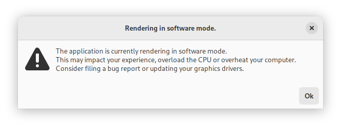
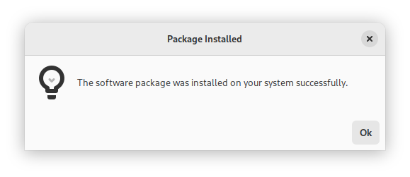
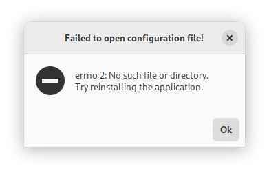

<div align="center">
        
        <h1>NvDialog</h1>
        <h5>A cross-platform dialog library.</h5>
</div>

<br>
<code>libnvdialog</code> is a simple dialog box library written in C
for multiple purposes such as games, app development, simple UI boxes for terminal apps or anything else. If you need something that doesn't require a bunch of setup this library is for you. <br>
NvDialog aims to be:
<ul>
<li>Very user friendly and easy to use.</li>
<li>Unbloated, clean from reluctant code and extra features.</li>
<li>Efficient and quick: The library's dialogs are designed to look and feel nice.</li>
<li>Easy to bind it to other languages (See <a href="https://crates.io/crates/nvdialog">crates.io</a> for an example)</li>
</ul>

<b>If you like this project, support it by recommending it and starring it. Thanks :)</b> <br>
<a href="https://androgr.github.io/libnvdialog">libnvdialog Website</a>
<br> <br>

# Backends
- **Adwaita Backend**\
A backend using Gtk4 and `libadwaita`. This backend has replaced the (following) Gtk3 backend since 0.2.0 was released. Also note, this backend makes use of hardware acceleration, which sometimes breaks games in Wayland.

- **Gtk3 Backend**\
Some older distributions do not have Adwaita / Gtk4 support yet. The Gtk3 backend can be used in such a situation. However Gtk3 is considered to be deprecated and has been replaced with the Adwaita backend.
- **Win32 Backend**\
Windows-specific backend, used only for Windows compatibility. This backend is mainly tested on GNU/Linux with `wine`, and so some bugs may not be detected. Open an issue if that's the case.

# Example
This is a simple cross-platform example of a simple message box greeting the user:
```c
#include <nvdialog/nvdialog.h>
#include <stdlib.h>

int main(int argc, char **argv)
{
        /*
         * First we need to initialize NvDialog, otherwise
         * we might end up with alot of runtime errors and bugs.
        */
        if (nvd_init(argv[0]) != 0) {
                puts("Failed to initialize NvDialog.\n");
                exit(EXIT_FAILURE);
        }

        /*
         * "Building" the dialog.
         * In this step we add all the data required to create
         * a dialog into a single variable. The dialog will not be
         * shown until we call nvd_show_dialog().
        */
        NvdDialogBox* dialog = nvd_dialog_box_new(
                "Hello, world!", // Title of the dialog
                "Hello world ! This is a dialog box created using libnvdialog!", // Message of the dialog
                NVD_DIALOG_SIMPLE // What is the dialog representing? (Eg a warning). In this
                                  // case, it represents a simple dialog with no context.
        );

        /*
         * And finally, showing the dialog to the user.
         * Note that this will halt the thread running the dialog,
         * so you may get things like "App not responding".
        */
        nvd_show_dialog(dialog);
        return 0;
}
```

# Screenshots
<div align="center">
        </img>
        <h5><i>Warning dialog using libnvdialog</i></h5>
</img>
        <h5><i>Info dialog using libnvdialog</i></h5>
</img>
        <h5><i>Error dialog using libnvdialog</i></h5>
</div>

# Installation
Make sure you have installed [CMake](https://cmake.org) before doing anything else ! The library can only be installed using CMake. See [CMake's website](https://cmake.org/) for more information.
- First, download the source code in your preferred way. The [Releases](https://github.com/AndroGR/nvdialog/releases/) are recommended if you are looking for stability, but you can also optionally compile from
the GitHub repository directly, by cloning the source code.
- Compile the library:
```sh
$ mkdir build/ && cd build/
$ cmake ..
$ cmake --build .
```

- And install it on your system:
```sh
$ sudo cmake --install .
```

# Installing on Arch Linux
###### *TODO: Upload the library to the AUR.*
For Arch Linux and derivatives, a `PKGBUILD` is provided to build the library as a package. It is recommended to use it this way to allow uninstalling the library easily.\
To install the library as an Arch Linux package, enter the following commands:

**Download `git`** (Required to download the source code)
```bash
$ sudo pacman -S git
```
**Clone the repository (To download the source code)**
```bash
$ git clone --depth=1 https://github.com/AndroGR/nvdialog.git
$ cd nvdialog/
```
**Build the package:**
```bash
$ makepkg --clean --install
```

# License
`nvdialog` is licensed under the MIT license. See [COPYING](./COPYING) for more.
All contributions made to the library are assumed to be licensed under the MIT license as well. However, you may specify a different license if you wish.
