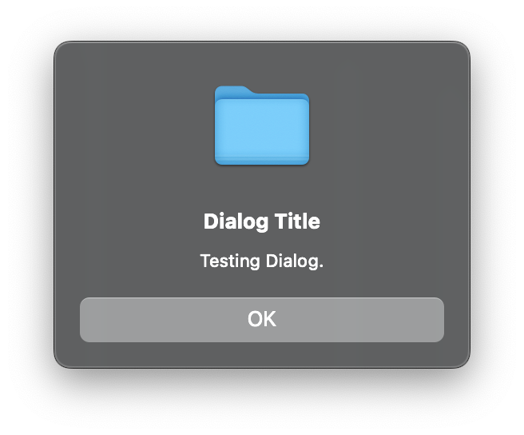

<div align="center">
        
        <h1>NvDialog</h1>
        <a href="#example">Examples</a> | 
        <a href="#screenshots">Screenshots</a> |
        <a href="#installation">Installing</a> |
        <a href="https://github.com/AndroGR/nvdialog/releases">Releases</a>
        <h5><b>A simple, cross-platform dialog box library.</b></h5>
<code>libnvdialog</code> is a simple, efficient, batteries-included dialog box library written in C
for multiple purposes such as games, app development, simple UI boxes for terminal apps or pretty much anything else. NvDialog uses the host's UI library (eg. <a href="https://gtk.org">Gtk3</a> on Linux and other Unix like OSes, <a href="https://developer.apple.com/library/archive/documentation/Cocoa/Conceptual/CocoaFundamentals/WhatIsCocoa/WhatIsCocoa.html">the Cocoa API</a> on macOS or the <a href="https://learn.microsoft.com/en-us/windows/win32/apiindex/windows-api-list">WinAPI</a> for Windows) to achieve a look and feel that follows the system theme and design guidelines without depending on extra libraries or themes. In addition, NvDialog provides official <a href="https://github.com/tseli0s/nvdialog-rs">Rust bindings</a> and can be used, thanks to its simple C ABI, with almost every language on the planet.
<br>
<br>


<br>


<br> <br>
<h6><i>This project is in immediate need of macOS-based contributors for the Cocoa backend. If you use this library consider contributing to support it.</i></h6>
</div>

# Features
- Simple, high level C API with low overhead (See [examples/](./examples/)).
- 100% guaranteed native looking dialogs.
- MIT Licensed.
- Cross-compiler (Actively tested with `gcc`, `clang` and MSVC).
- Supports most desktop platforms through 3 different implementations (Backends).
- Safe, bug-free, and does not get in your way.
- Wor
- Legacy version support (See [OS Versions Supported](#os-versions-supported))

# Backends
- **Gtk3 Backend**\
The most battle-hardened backend, using pure Gtk3 to create the dialogs. On GNU/Linux this does mean you will need to have Gtk3 installed but almost all modern distributions include it which was the primary motivator for making it the default backend on GNU/Linux. It is actively tested and works on almost all distributions regardless of desktop, windowing system or hardening features.

- **Sandbox Backend**\
The sandbox backend is used in place of the other backends when the process is under some kind of sandbox (Flatpak, AppImage, etc). It is mostly identical to the Gtk3 one but uses more native technologies to display the file dialogs. With version v0.10, the backend was merged with the `gtk` one.

- **Cocoa Backend**\
The Cocoa backend was recently added to NvDialog for macOS X support. It is written in Objective-C for better integration with the OS, and is still in the experimental stage although it should work fine by now. Please report any bugs or features that need to be fixed / implemented, or make a pull request to add them yourself.

- **Win32 Backend**\
The default backend on Windows systems, relying on WinAPI. It is also actively tested and works well, even in super outdated systems like Windows XP. However, some minor customization options may not work due to the limited features of the API - Make sure your program works well using that license!


- **Adwaita Backend**\
> [!WARNING]
> This backend is being deprecated as of v0.10, see PR 60 for details. If you use `libnvdialog` with this backend it's strongly advised that you switch away.

This backend was added as an alternative to the `gtk` backend on GNU/Linux to provide better integration with GNOME environments, however it is being deprecated and you should not enable it.

# Example
This is a simple cross-platform example of a simple message box greeting the user:
```c
#include <stdlib.h>
#include <nvdialog/nvdialog.h>

int main(int argc, char **argv)
{
        /* Initializing the library is important to find which functions to use in each platform, initialize the system and
         * ensure that any runtime dependencies are present */
        if (nvd_init(argv[0]) != 0) {
                puts("Failed to initialize NvDialog.\n");
                exit(EXIT_FAILURE);
        }

        /* Constructing the dialog. */
        NvdDialogBox* dialog = nvd_dialog_box_new(
                "Hello, world!", // Title of the dialog
                "Hello world ! This is a dialog box created using libnvdialog!", // Message of the dialog
                NVD_DIALOG_SIMPLE // What is the dialog representing? (Eg a warning). In this
                                  // case, it represents a simple dialog with no context.
        );

        /* Showing the dialog to the user/client. */
        nvd_show_dialog(dialog);
        /* Freeing the dialog is important since it takes up memory to exist. */
        nvd_free_object(dialog);
        return 0;
}
```

# Screenshots
### The same dialog running on three different platforms: Windows, macOS, Linux.
<div style="display: flex; justify-content: space-around; text-align: center;">
        <div id="first-screenshot">
                <h6><i>Windows</i></h6>
                
        </div>
        <div id="third-screenshot">
                <h6><i>macOS</i></h6>
                
        </div>
        <div id="third-screenshot">
                <h6><i>Linux</i></h6>
                
        </div>
</div>

# Installation
Make sure you have installed [CMake](https://cmake.org) before doing anything else ! The library can only be installed using CMake. See [CMake's website](https://cmake.org/) for more information.
- First, download the source code in your preferred way. The [Releases](https://github.com/tseli0s/nvdialog/releases/) are recommended if you are looking for stability, but you can also optionally compile from the `master` branch directly, by cloning the source code.
- Install dependencies (This is only required on Linux, and only if you're building from source):
```sh
# Debian
$ sudo apt update && sudo apt install libgtk-3-dev build-essential gcc
```
```sh
# Arch
$ sudo pacman -S gtk3 base-devel
```


- Compile the library:
```sh
$ mkdir build/ && cd build/
$ cmake ..
$ cmake --build .
```

- And install it on your system:
```sh
$ sudo cmake --install .
```

# Installing on Arch Linux
###### *TODO: Upload the library to the AUR.*
For Arch Linux and derivatives, a `PKGBUILD` is provided to build the library as a package. It is recommended to use it this way to allow uninstalling and managing the library easily.\
To install the library as an Arch Linux package, enter the following commands:

**Download `git`** (Required to download the source code)
```bash
$ sudo pacman -S git
```
**Clone the repository (To download the source code)**
```bash
$ git clone --depth=1 https://github.com/tseli0s/nvdialog.git
$ cd nvdialog/
```
**Build the package:**
```bash
$ makepkg --clean --install
```


# OS Versions Supported
## Windows
The oldest OS NvDialog has ran on is Windows XP, although some calls did not produce any change / output (But did not fail either). The recommended minumum is Windows 8 / 8.1, and any later version should work as expected.

## macOS
Only the very latest versions of macOS are supported. Older releases will at best throw a compiler error if compiling from source or a linking error otherwise.

Some deprecated functions are used here and there when building for macOS. This shouldn't worry you since Apple does give enough time for developers to switch away without enforcing it.

## GNU/Linux
Since there are well over 1000 distributions, there is no specific distribution requirement. However, your system must have these installed:
- Gtk 3 (3.18 or later).
- Linux kernel 2.6 or newer (All modern distros include at least 4.x kernels so nothing to worry here).
- X11 or Wayland as the display server. Mir is supported but advised against.
- Preferably a Vulkan driver for hardware acceleration.

Common distros officially supported:
| Distro | Version |
|   ---  |   ---   |
| Arch Linux | (Rolling) |
| Ubuntu and derivatives | >14.04 |
| Debian and derivatives | >Debian 6.0 |
| Slackware Linux | Latest |

## Android
Android support will not be implemented anytime soon (Nor iOS support). You are advised instead to use Android's `AlertDialog` class or your UI library, which would achieve the same effect, since you'd have to use Java in your application anyways.

## Other OSes
Other OSes are assumed to be supported. To make sure they do indeed work, you need to make sure the given OS supports **all** of the following features:
- Unix-like, or alternatively, **very closely** resembling Windows (If the latter, ignore the following).
- X11 or Wayland as the windowing system
- Gtk3, or Gtk4 and Libadwaita

# Current Status
As of August 2025, the main focus of development is to stabilize and standardize all interfaces, and switch the library to maintenance mode only, as I believe there isn't much left to add. The long term plan is to release v1.0 and stop there, only making sure the library runs well from that point forward. In addition, to make sure that the library is truly seamless across platforms and systems, extra attention will be given to the `cocoa` and `win32` backends and more extensive testing will take place.

To achieve the latter, I now test various projects using `libnvdialog` both on my main OS (Arch Linux) and a Windows 10 machine, and I've been able to run executables linked with nvdialog all the way back to Windows XP and Ubuntu 14.04 comfortably. That being said, enormous work has been done to ensure that `libnvdialog` works as expected on all platforms. The final aim is to make sure that two projects using two different versions of `libnvdialog` from v0.10 forward can both work with different versions unless they explicitly forbid so.

# Why should I use this?
In general, NvDialog tries to wrap for you about 2000 lines of code you'd have written anyways and make sure that this code will work on a variety of systems while still matching the system's theme and looks. In addition, it abstracts all of the platform specific details into easy to read, simple APIs, which you'd have to do yourself otherwise depending on the compiler and OS. However, NvDialog may not be for you *if*:
- You are already writing a GUI applications with a framework like Qt, and you want your dialogs to match that framework's look instead of the system. NvDialog *always* uses whatever the system provides, it does not care what your applications is.
- You want something with far more customization, since the library avoids creating its own widgets and using as many "premade" ones as possible (Like `MessageBox` on Windows), meaning that no customization is allowed apart from any theming/adjustments the user will do.
- You want something that works with Android - As mentioned [here](#android), using `AlertDialog` directly yourself will work better.

# License
`nvdialog` is licensed under the MIT license. See [COPYING](./COPYING) for more.
All contributions made to the library are assumed to be licensed under the MIT license as well. However, you may specify a different license if you wish.
