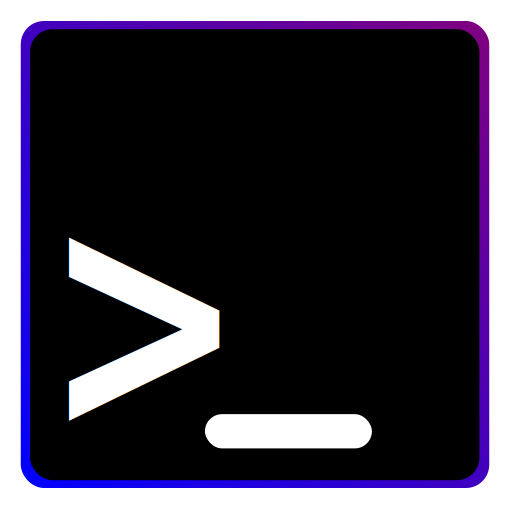

<div align="center">
        <h1>nvd-shell: A command-line utility to display dialog boxes.</h1>
        
        <p style="padding: 20px">
        nvd-shell is a command-line utility to display dialog boxes from a script or a terminal. It can be compared with <a href="https://gitlab.gnome.org/GNOME/zenity"> Zenity from GNOME</a> or <a href="https://develop.kde.org/deploy/kdialog/">KDialog from KDE</a>, however it targets multi-platform support and nice integration with the host OS. <code>nvd-shell</code> is part
        of the <a href="https://github.com/AndroGR/nvdialog">NvDialog library</a> and serves as a testing
        ground for it.
        </p>
        <br>
</div>

# Installation
For now (Until the project is considered stable), `Makefiles` are used. You will need to install:
- [CLang++](https://clang.llvm.org/) (Or another C++ compiler),
- [GNU Make](https://www.gnu.org/software/make/) (Or any other Makefile parser), and
- [NvDialog](https://androgr.github.io/libnvdialog/)

After installing all of these, type the following commands:
```sh
$ git clone https://github.com/AndroGR/nvdialog.git && cd nvdialog/nvd-shell/
$ make -j`nproc` && sudo make install
```

# Example Usage
This is how to display a single window greeting the user:
```sh
$ nvd-shell --title "Hello $USER" --content "Hello Mr. $USER. This is a dialog message from nvd-shell." --type 1
```
For more information, take a look at the manpage (Available after each installation).

# License
This program is licensed under the GPLv3 license. See [COPYING](COPYING) for details.
